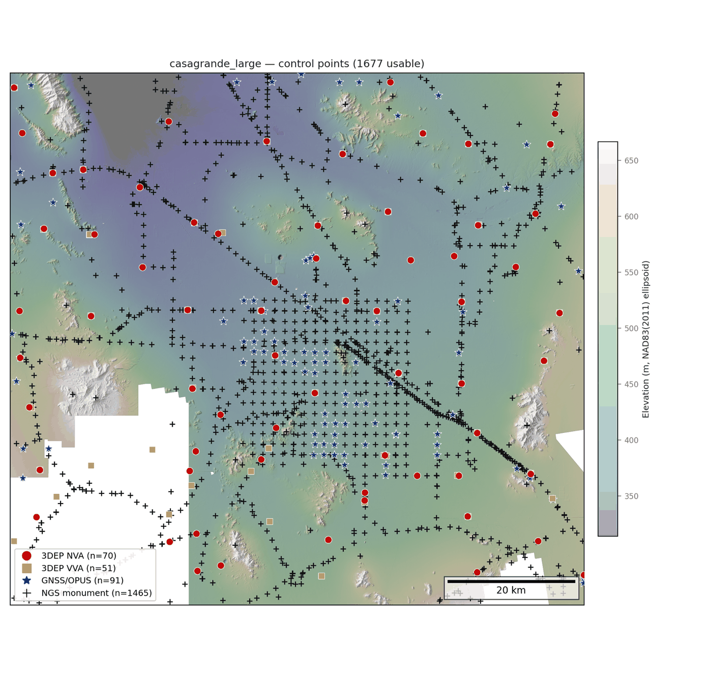
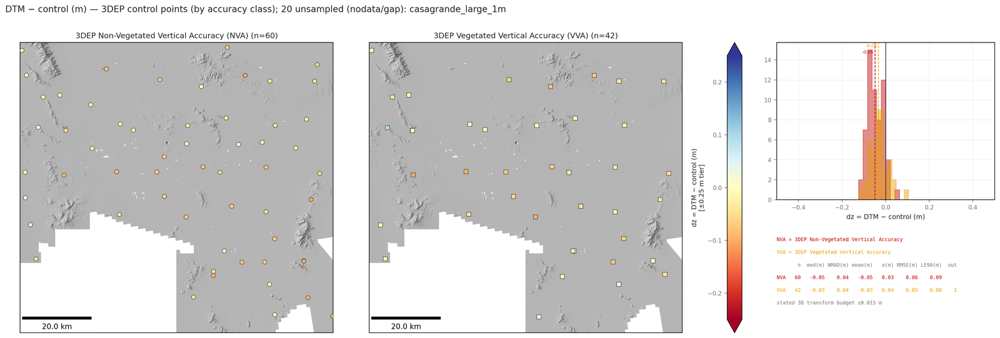

# groundcontrol

[](https://github.com/uw-cryo/groundcontrol/actions/workflows/ci.yml)
[](https://doi.org/10.5281/zenodo.21846300)

Fetch ground control points for an arbitrary AOI and assess DEM accuracy — with rigorous
3D CRS / datum / epoch handling as the core competency.

> Given an arbitrary AOI, fetch available control points (with correct datum/epoch handling);
> and given a DEM, sample the control, run the accuracy assessment, and produce the
> analysis + visualization for vertical/horizontal accuracy.



## Status

**v0.1.2 — pre-alpha, quiet release.** The fetch → transform → sample → statistics →
figures pipeline works end to end (CLI + Python API) and is covered by **282 offline
tests** run in CI on Python 3.10/3.12, with the geodesy core additionally adversarially
audited (independent review agents; math cross-checked against external oracles). The API
may still move between minor versions — pin the tag if you build on it, and expect sharp
edges to be documented rather than hidden: the library's design principle is **fail-loud**
(no silent datum guesses, no ballpark transforms, no fabricated epoch motion).

## What works today

**Control sources** — via the `fetch_control` dispatcher, each degrading gracefully into a
per-source status report:

| Source | Key | Notes |
|--------|-----|-------|
| USGS 3DEP checkpoints | `3dep` | national GeoParquet with bbox pushdown |
| NGS Data Explorer (NDE) | `ngs` | monumented control, per-realization datum landing |
| OPUS shared solutions | `opus` | GNSS-derived |
| Nevada Geodetic Lab GNSS | `ngl` | daily `.tenv3` series, `steps.txt`, MIDAS velocities |
| FAA NASR runway control | `faa` | photo-identifiable runway ends, displaced thresholds, helipads from the public-domain 28-day NASR subscription; per-point position-source provenance (surveyed vs estimated) with AC 150/5300-18C accuracies on the surveyed class |

- **One normalized schema** (`schema.py`) — a single canonical control-point GeoDataFrame
  contract: source/id, height + datum provenance, `ref_frame`, `frame_epoch` / `coord_epoch` /
  `measurement_epoch`, per-station velocities, a durable `epoch_residual_m` honesty column,
  native coordinates for lossless re-targeting, and a `transform_id` provenance join key.
- **CRS / datum / epoch engine** (`crs.py`) — cached, fail-loud, AOI-aware `get_transformer`;
  `transform_points` (packaged 3D/4D control→DEM-frame transform); `land_horizontal`
  (per-datum landing of mixed NAD83 realizations via NADCON5, validated against NGS NCAT
  to < 1 cm); **stage-2 epoch propagation** (`propagate_epoch`) with a velocity ladder of
  per-point MIDAS ENU → plate-motion model (bundled **ITRF2020 PMM** poles + PB2002
  per-point plate assignment) → no-op with the velocity·Δt bound surfaced; static-frame
  guards so plate motion is never fabricated inside NAD83(2011).
- **Assessment pipeline** (`assess.py` + `groundcontrol-assess`) — `transform_control`
  (one direct 3D transform, declared-CRS guard, per-point `xform_acc_m` stated transform
  budget) → `sample_products` → `summarize_dz` → standard validation figures, with
  GeoParquet + provenance outputs.
- **Accuracy** (`accuracy.py`) — dual-track reporting: robust median/NMAD over all finite
  residuals plus the parametric set the cal/val community expects (mean, σ, RMSE,
  LE90/LE95, CE90) after an outlier gate, per ASPRS Positional Accuracy Standards Ed. 2 /
  USGS Lidar Base Specification vocabulary (see `docs/accuracy_conventions.md`).
- **DEM sampling** (`sample.py`) — windowed and in-memory paths, bilinear / nearest /
  radius-neighborhood statistics, `diff` mode; mosaic gaps reported, never dropped.
- **Geodesy utilities** (`geodesy.py`) — programmatic UTM/3D CRS construction,
  epoch-pinned PROJ pipelines, vertical-transform preflight (missing geoid grids raise,
  never silently zero).
- **Figures** (`figures.py`, `plot.py`) — standard per-site control bundle, per-family
  dz maps + dual-track histograms, MIDAS velocity maps ([gallery](docs/gallery.md)).
- **I/O + provenance** (`io.py`) — GeoParquet / CSV export with an embedded, replayable
  transform-provenance sidecar; `read_provenance`.

## Example

Fetch control for an AOI, then assess DEM products against it:

```bash
# bbox is minx,miny,maxx,maxy in EPSG:4326 (lon/lat); use --aoi=... for negative longitudes
groundcontrol-fetch --aoi=-115.3,36.0,-114.9,36.3 --sources 3dep,ngs,opus --out control.parquet

groundcontrol-assess --aoi site_aoi.geojson --product DTM=dtm.vrt --product DSM=dsm.vrt \
    --target-crs dem_frame.wkt --outdir out/ --site-name mysite
```

From Python (see [`docs/quickstart.md`](docs/quickstart.md) for the full pattern):

```python
from pathlib import Path

from groundcontrol.sources import fetch_control
from groundcontrol.assess import assess_products
from groundcontrol import io

control, status = fetch_control("aoi.geojson", sources=("3dep", "ngs", "opus"))
io.write(control, "control.parquet", status=status)
target_crs = Path("dem_frame.wkt").read_text()
sampled, stats, artifacts = assess_products(
    control, {"DTM": "dtm.vrt"}, target_crs=target_crs,
    outdir="out", site_name="mysite")
```

What the standard outputs look like on a real site: **[docs/gallery.md](docs/gallery.md)**.



## Not yet implemented

- **Fetch-side `--target-crs`/`--target-epoch` landing** — fetch lands on
  EPSG:6318 + NAVD88; target-frame landing happens in the assess step
  (`transform_control`). Passing a target to `fetch_control` raises.
- **`user_points` source** — offline CSV/GPKG ingest (vendor checkpoint tables, RTK/PPK
  field campaigns); designed, not built.
- **Per-point accumulated transform budgets** — `xform_acc_m` currently covers the assess
  leg; accumulating the per-realization landing legs is next.
- **`epoch_acc_m`** — velocity-uncertainty propagation through the stage-2 tiers.
- **ICESat-2 as a global dense-control source** — planned (see the sources survey).

## Install

Install from a git tag, and **pin it**: the schema is not frozen, so column names may still
change between minor versions. A **conda-forge package is the planned distribution
channel**; PyPI is blocked while an unrelated, abandoned package holds the
`groundcontrol` name (reclamation in progress — PyPI also rejects near-identical names
like `ground-control` as too similar).

> ⚠️ `pip install groundcontrol` silently installs that **unrelated** PyPI package, not
> this library. Use the git URL below.

```bash
pip install git+https://github.com/uw-cryo/groundcontrol.git@v0.1.2
```

Into an env that already satisfies the geo stack (geopandas>=1.0, pyproj>=3.6, rasterio,
rioxarray), add `--no-deps` so pip leaves the solved environment alone. See
[`docs/quickstart.md`](docs/quickstart.md) for the downstream-consumer recipe.

For development:

```bash
pip install -e ".[dev]"
pytest -m "not network"   # offline suite; drop the marker to include live-API tests
ruff check .              # lint (line-length 100)
```

## Package layout

```
src/groundcontrol/
  schema.py        canonical control-point GeoDataFrame contract
  crs.py           CRS/datum/epoch transforms, landing, stage-2 epoch propagation, PMM
  geodesy.py       CRS construction, epoch-pinned pipelines, vertical preflight
  velocity.py      MIDAS velocity interpolation / fill
  assess.py        transform -> sample -> stats assessment pipeline
  sample.py        raster sampling (windowed / in-memory / radius)
  accuracy.py      dual-track residual statistics (robust + ASPRS/LBS parametric)
  io.py            GeoParquet/CSV export + transform provenance
  figures.py       standard per-site control + validation figure bundles
  plot.py          map/velocity/hillshade plotting primitives
  cli.py           console entry points (groundcontrol-fetch, groundcontrol-assess)
  sources/         3dep, ngs/opus, ngl providers + fetch_control dispatcher
  data/            bundled ITRF2020 PMM poles + PB2002 plate boundaries (ODC-By 1.0)
```

## Documentation

- [`docs/gallery.md`](docs/gallery.md) — standard outputs on a real site
- [`docs/quickstart.md`](docs/quickstart.md) — consuming groundcontrol from another project
- [`docs/accuracy_conventions.md`](docs/accuracy_conventions.md) — accuracy semantics and
  reporting conventions
- [`docs/crs_implementation.md`](docs/crs_implementation.md) — verified CRS/epoch directives,
  transform-provenance spec, and validation-fixture design
- [`docs/plan.md`](docs/plan.md) — full design and migration plan
- [`docs/control_sources_survey.md`](docs/control_sources_survey.md) — candidate sources
  beyond the implemented set

## Citation

Archived on Zenodo — the concept DOI below always resolves to the latest release, and each
release also gets its own version DOI. Machine-readable metadata lives in
[`CITATION.cff`](CITATION.cff) (GitHub's *Cite this repository* button reads it).

> Shean, D. (2026). *groundcontrol* (v0.1.2). Zenodo. https://doi.org/10.5281/zenodo.21846300

## Origin

Core functionality extracted and generalized from prior UW-cryo project code, 2026.
Datum/epoch recipes follow
[uw-cryo/3D_CRS_Transformation_Resources](https://github.com/uw-cryo/3D_CRS_Transformation_Resources).
Bundled plate-boundary data: Bird (2003) PB2002 via
[fraxen/tectonicplates](https://github.com/fraxen/tectonicplates) (ODC-By 1.0); plate poles:
Altamimi et al. (2023) ITRF2020 PMM.
