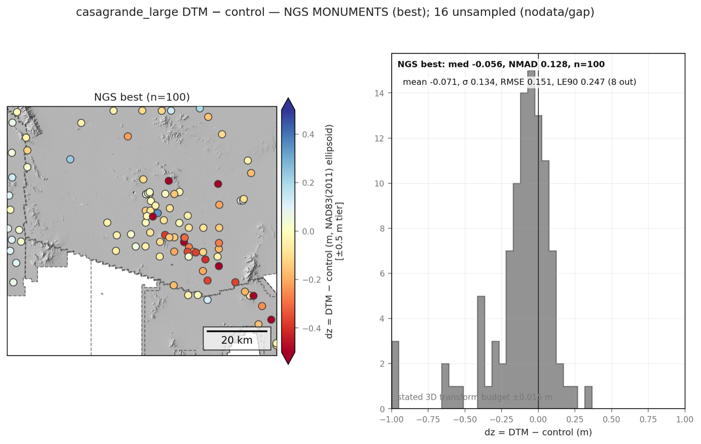
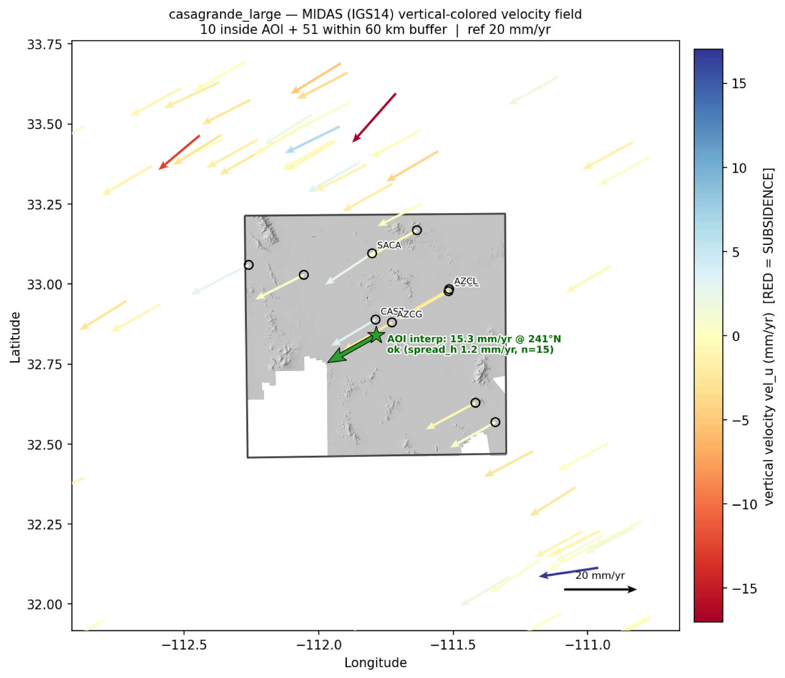
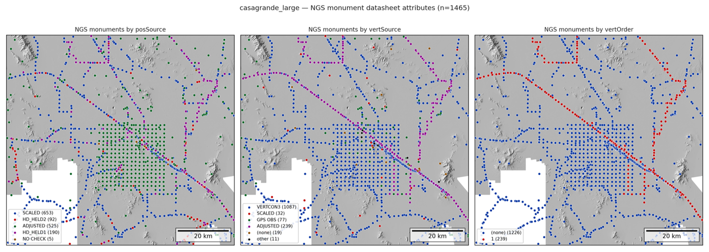

# Gallery — standard outputs on a real site

Everything below is produced by the standard library figure functions
(`figures.standard_control_figures`, `figures.family_dz_figures`,
`plot.plot_velocity_vectors`) run over **public data only**: USGS 3DEP lidar
products and checkpoints, NGS datasheets and OPUS shared solutions, and
Nevada Geodetic Lab GNSS series. Site: Casa Grande, AZ — a subsiding basin
containing an NGS calibration range, which makes it a demanding test of the
datum/epoch machinery (control spans 1940s leveling to 2020s GNSS).

## 1. Multi-source control fetch

`fetch_control` on a ~60 km AOI: 1,677 usable points from four sources in one
normalized schema, plotted over the 3DEP DTM + hillshade with datum-tagged
elevation. The dense central grid is the NGS calibration range.

## 2. DEM accuracy assessment with dual-track statistics

`assess_products` → `family_dz_figures`: the 3DEP checkpoint family vs the
1 m 3DEP DTM. One map per checkpoint subclass (NVA / VVA) so co-located
pairs don't overplot, empirical tier-snapped color limits, lidar project
boundaries dashed for seam checks, and both statistical tracks on the
histogram — robust median/NMAD over all points plus the parametric set the
cal/val community expects (mean, σ, RMSE, LE90 after a 3·NMAD gate; ASPRS
Ed. 2 / USGS LBS vocabulary). Unsampled points (mosaic gaps) are counted in
the title, never silently dropped; the stated 3D transform budget for the
control landing is printed on every histogram.

## 3. Historic-control quality tiers

The same machinery on the "best available" NGS monument tier (ADJUSTED
horizontal + NAD83(2011) realization or GPS-grade vertical). Height checks
against decades-old monuments in a subsiding basin are dominated by control
vintage, not DEM error — the per-realization datum landing and the
quality-tier filters are what make that separable.

## 4. GNSS vertical velocities (MIDAS)

`plot_velocity_vectors` with per-station MIDAS rates over hillshade — RED =
subsidence by convention throughout the library. This is the observed
velocity field that stage-2 epoch propagation (`propagate_epoch`) consumes.

## 5. Datasheet quality attributes

NGS monuments faceted by the datasheet fields (`posSource` / `vertSource` /
`vertOrder`) lifted from the raw records by `ngs.expand_attributes` — the
basis for the empirical quality tiers above.

