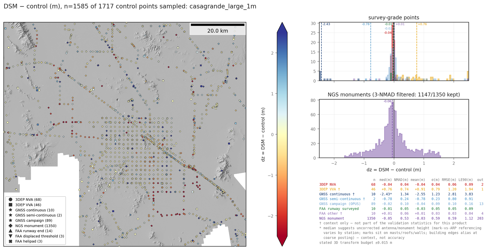
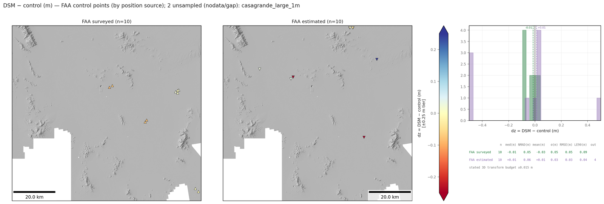
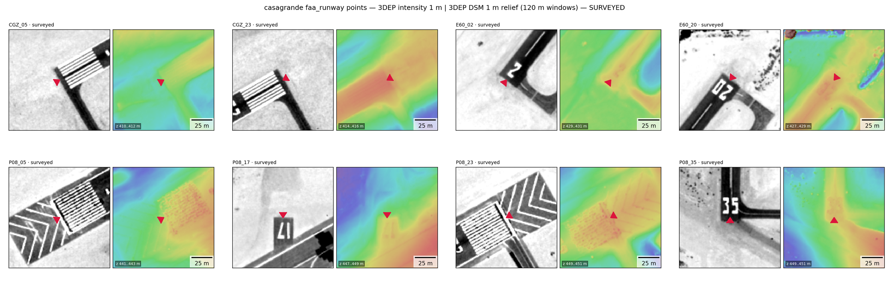

# Gallery — standard outputs on a real site

Everything below is produced by the standard library figure functions
(`figures.standard_control_figures`, `figures.validation_dz_figures`,
`figures.family_dz_figures`, `figures.point_context_gallery`,
`plot.plot_velocity_vectors`) run over **public data only**: USGS 3DEP lidar
products (DSM/DTM/intensity) and checkpoints, NGS datasheets and OPUS shared
solutions, Nevada Geodetic Lab GNSS series, and FAA NASR runway control.
Site: Casa Grande, AZ — a subsiding basin containing an NGS calibration
range, which makes it a demanding test of the datum/epoch machinery (control
spans 1940s leveling to 2020s GNSS).

## 1. Multi-source control fetch

`fetch_control` on a ~60 km AOI: 1,677 usable points from four sources in one
normalized schema, plotted over the 3DEP DTM + hillshade with datum-tagged
elevation. The dense central grid is the NGS calibration range.

## 2. DEM accuracy assessment with dual-track statistics

`assess_products` → `family_dz_figures`: the 3DEP checkpoint family vs the
1 m 3DEP DTM. One map per checkpoint subclass (NVA / VVA) so co-located
pairs don't overplot, empirical tier-snapped color limits, lidar project
boundaries dashed for seam checks, and both statistical tracks on the
histogram — robust median/NMAD over all points plus the parametric set the
cal/val community expects (mean, σ, RMSE, LE90 after a 3·NMAD gate; ASPRS
Ed. 2 / USGS LBS vocabulary). Unsampled points (mosaic gaps) are counted in
the title, never silently dropped; the stated 3D transform budget for the
control landing is printed on every histogram.

## 2b. The CLI's own output: bring-your-own-DEM

`groundcontrol-assess --product DSM=<1 m 3DEP DSM mosaic> --control <cache>
--target-crs <3D UTM .wkt> --outdir out/ --site-name casagrande` — nothing else.
The AOI is the mosaic's valid-data footprint, the underlay is a hillshade
computed from the product, and the figure is `validation_dz_figures`: every
control segment on one map plus the survey-grade histograms (3DEP NVA
checkpoints, OPUS campaign GNSS) and the NGS-monument histogram after a
3·NMAD gate. Here 1,550 sampled points over the 60 km mosaic, NVA median
−0.040 m / NMAD 0.042 m. Run on this mosaic: 69 s end to end, of which the
footprint and the hillshade take ~3 s.

## 3. Historic-control quality tiers

The same machinery on the "best available" NGS monument tier (ADJUSTED
horizontal + NAD83(2011) realization or GPS-grade vertical). Height checks
against decades-old monuments in a subsiding basin are dominated by control
vintage, not DEM error — the per-realization datum landing and the
quality-tier filters are what make that separable.

## 4. GNSS vertical velocities (MIDAS)

`plot_velocity_vectors` with per-station MIDAS rates over hillshade — RED =
subsidence by convention throughout the library. This is the observed
velocity field that stage-2 epoch propagation (`propagate_epoch`) consumes.

## 5. Datasheet quality attributes

NGS monuments faceted by the datasheet fields (`posSource` / `vertSource` /
`vertOrder`) lifted from the raw records by `ngs.expand_attributes` — the
basis for the empirical quality tiers above.

## 6. FAA NASR runway control

The `faa` source: runway ends, displaced thresholds and helipads from the
public-domain NASR subscription, split by the published coordinate
provenance. `family_dz_figures` family `faa` — the surveyed class (3RD PARTY
SURVEY / NGS / MILITARY / ARPTS CONTRACTOR, AC 150/5300-18C survey-grade)
against the 3DEP DSM sits at +0.02 m median; the estimated class (OWNER /
FAA-EST IMAGERY / ADO) is what its name says, and stays visible as context
rather than being filtered away upstream. The stated 3D transform budget for
the NAD83(2011)+NAVD88 → ellipsoidal-UTM landing is printed on the histogram.

## 7. Per-point context contact sheets

`point_context_gallery` — standard in the `assess_products` bundle for the
GNSS and FAA subsets (`figures.context_sheets`), opt-in for custom layer
stacks like this one: for every control point a strip of image windows — here 120 m windows of 3DEP lidar intensity and the
3DEP DSM as color shaded relief — with the point's own marker (runway-end
chevrons rotate to the published runway heading). Threshold paint and runway
numbers are bright in intensity, so the surveyed FAA positions can be checked
against the pavement features by eye; the same sheet takes an RGB ortho or a
web basemap as the first panel (`kind="rgb"`, with a fallback chain for
ortho nodata holes). Sheets paginate, and surveyed / estimated classes never
share a page.

