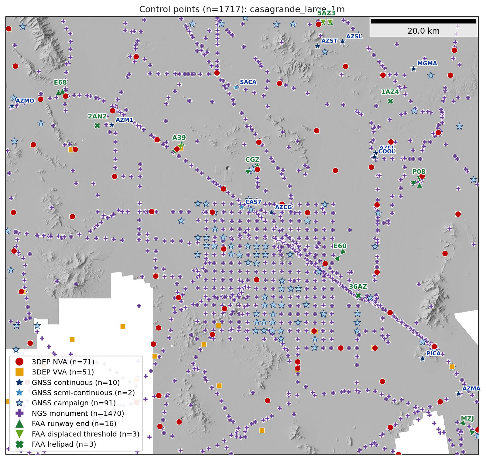
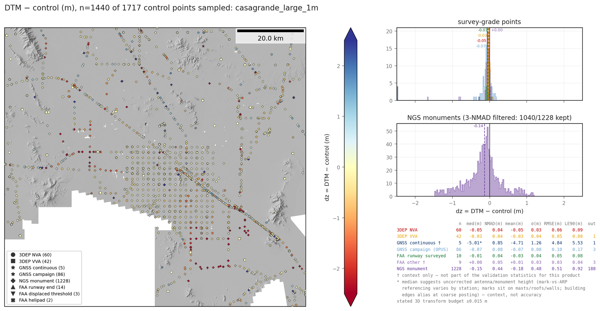
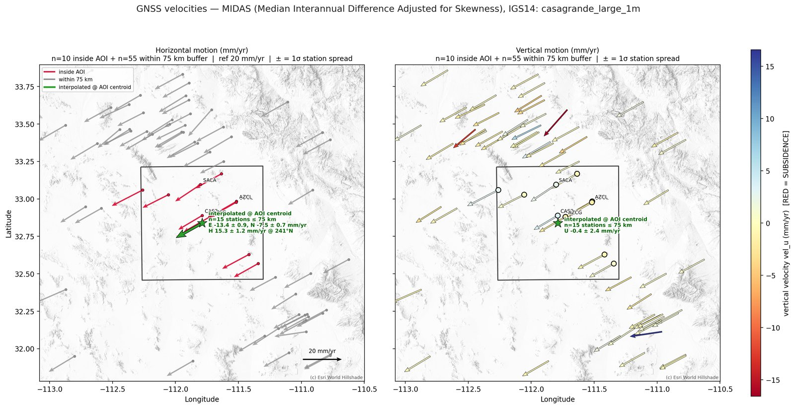
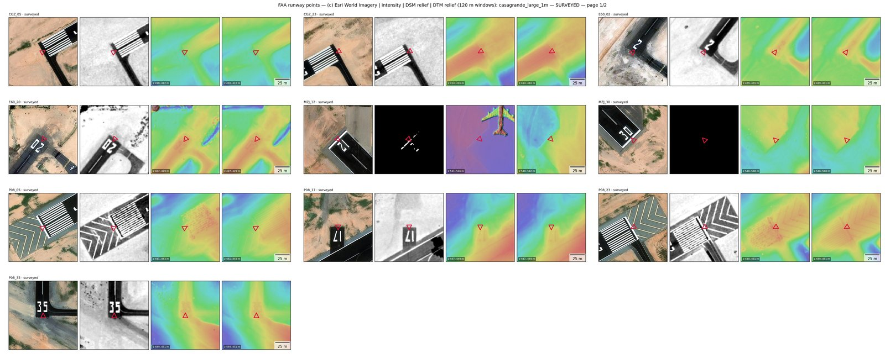
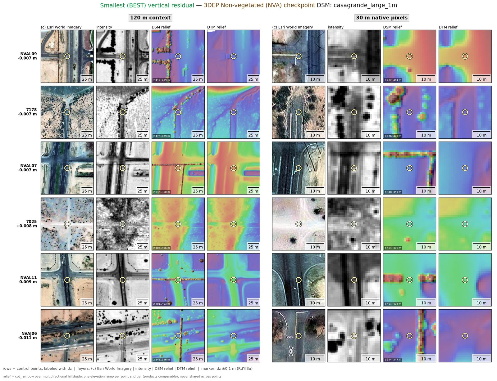
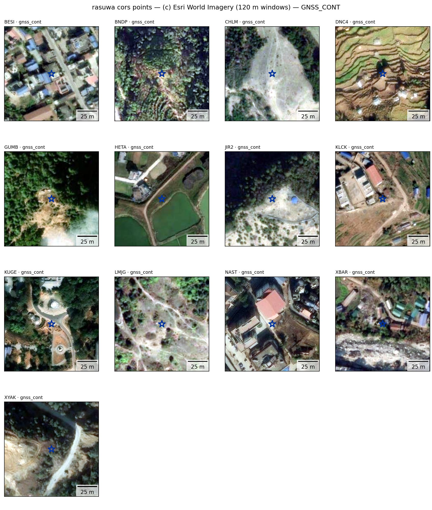

# Gallery — standard outputs on a real site

Everything below is produced by the standard library figure functions
(`figures.standard_control_figures`, `figures.validation_dz_figures`,
`figures.family_dz_figures`, `figures.point_context_gallery`,
`plot.plot_velocity_vectors`) run over **public data only**: USGS 3DEP lidar
products (DSM/DTM/intensity) and checkpoints, NGS datasheets and OPUS shared
solutions, Nevada Geodetic Lab GNSS series, and FAA NASR runway control.
Site: Casa Grande, AZ — a subsiding basin containing an NGS calibration
range, which makes it a demanding test of the datum/epoch machinery (control
spans 1940s leveling to 2020s GNSS).

## 1. Multi-source control fetch

`fetch_control` on a ~60 km AOI: 1,707 points from five sources in one
normalized schema — 3DEP checkpoints, NGS monuments, OPUS campaign GNSS, and
FAA runway control (rotated runway-end chevrons, helipad H-rings) — over the
product hillshade. Sparse named classes carry labels (CORS/GNSS station ids
per point, FAA one label per airport) so every contact-sheet cell can be
located on the map; dense classes are never labeled. This is the standard
`{site}_control_map.png` written by `groundcontrol-assess` and
`groundcontrol-fetch` alike.

## 2. DEM accuracy assessment with dual-track statistics

`assess_products` → `family_dz_figures`: the 3DEP checkpoint family vs the
1 m 3DEP DTM. One map per checkpoint subclass (NVA / VVA) so co-located
pairs don't overplot, empirical tier-snapped color limits, lidar project
boundaries dashed for seam checks, and both statistical tracks on the
histogram — robust median/NMAD over all points plus the parametric set the
cal/val community expects (mean, σ, RMSE, LE90 after a 3·NMAD gate; ASPRS
Ed. 2 / USGS LBS vocabulary). Unsampled points (mosaic gaps) are counted in
the title, never silently dropped; the stated 3D transform budget for the
control landing is printed on every histogram.

## 2b. The CLI's own output: bring-your-own-DEM

`groundcontrol-assess <1 m 3DEP DSM mosaic>.vrt <DTM mosaic>.vrt --intensity
<intensity mosaic>.vrt --context-sheets` — nothing else: rasters classify
themselves (a filename containing `DTM` gets the bare-earth rules), the target
frame is the product's own 3D CRS, the site name is the inputs' common prefix.
The AOI is the mosaic's grid extent (`--valid-footprint` for the valid-data footprint), the underlay is a hillshade
computed from the product, and the figure is `validation_dz_figures`: every
control segment on one map — marker SHAPE carries the class (checkpoints,
GNSS stars, NGS monuments, FAA chevrons — the same symbology as the control
map), color stays the dz ramp — plus the survey-grade histograms (3DEP NVA
checkpoints, OPUS campaign GNSS, FAA surveyed runway points) and the
NGS-monument histogram after a 3·NMAD gate; the title counts sampled against
fetched control (unsampled = outside the data or in a gap). Here 1,593 of
1,725 control points over the 60 km mosaic, NVA median −0.040 m / NMAD
0.042 m. The DSM+DTM run with context sheets: 190 s end to end, of which
transform + sampling take 32 s.

The same figure for the bare-earth product: VVA checkpoints now validate
(the canopy tail is gone), and the NGS monuments tighten.

## 3. Historic-control quality tiers

The same machinery on the "best available" NGS monument tier (ADJUSTED
horizontal + NAD83(2011) realization or GPS-grade vertical). Height checks
against decades-old monuments in a subsiding basin are dominated by control
vintage, not DEM error — the per-realization datum landing and the
quality-tier filters are what make that separable.

## 4. GNSS velocities (MIDAS)

The standard combined velocity figure (`ngl/` in every assessment output
tree): horizontal quiver and vertical-colored panels over the DEM
hillshade, with the network velocity interpolated at the AOI centroid —
RED = subsidence by convention throughout the library. This is the
observed velocity field that stage-2 epoch propagation
(`propagate_epoch`) consumes.

## 5. Datasheet quality attributes

NGS monuments faceted by the datasheet fields (`posSource` / `vertSource` /
`vertOrder`) lifted from the raw records by `ngs.expand_attributes` — the
basis for the empirical quality tiers above.

## 6. FAA NASR runway control

The `faa` source: runway ends, displaced thresholds and helipads from the
public-domain NASR subscription, split by the published coordinate
provenance. `family_dz_figures` family `faa` — the surveyed class (3RD PARTY
SURVEY / NGS / MILITARY / ARPTS CONTRACTOR, AC 150/5300-18C survey-grade)
against the 3DEP DSM sits at −0.01 m median; the estimated class (OWNER /
FAA-EST IMAGERY / ADO) is what its name says, and stays visible as context
rather than being filtered away upstream. Service-branch-owned facilities
(NASR ownership MA/MN/MR/CG) are a third class: their DoD-pipeline
elevations are EGM96 MSL, not NAVD88 (verified across 170 CONUS facilities
against 3DEP: slope +0.90 on the local EGM96−NAVD88 separation), so they
declare EGM96 and land through the geoid and the ITRF2014 frame tie; with
no published accuracy they stay context. The stated 3D transform budget for
the NAD83(2011)+NAVD88 → ellipsoidal-UTM landing is printed on the histogram.

## 7. Per-point context contact sheets

`figures.context_sheets`, opt-in via `--context-sheets` (`sheets=True`): contact
sheets broken out by what came back (`cors` / `opus` / `gnss_other` /
`faa_runway` / `3dep_nva` / `3dep_vva`) at two tiers (120 m context + 30 m
native-pixel). Panels adapt to the available layers — here the FAA surveyed
page with the full stack: web-basemap RGB (Esri World Imagery, credited in
the title; a user ortho rides in front with the web tiles as nodata
fallback) | 3DEP lidar intensity | DSM color shaded relief, with the point's
own marker (runway-end chevrons rotate to the published runway heading,
helipad H-rings surround the pad paint). Threshold paint and runway numbers
are bright in both imagery and intensity, so surveyed FAA positions are
checkable against the pavement by eye; surveyed / estimated classes never
share a page. Imagery panels: (c) Esri World Imagery.

## 7b. Residual review sheets: largest and smallest dz per control subset

Written on every `groundcontrol-assess` run (capped, so a bounded page
count): for each control subset and product, the six largest and the six
smallest |dz| points as imagery | lidar intensity | DSM relief | DTM relief
windows at the two standard tiers, each row labeled with its dz. The
"largest" page is where a biased control point (a monument on a mast or
roof, a canopy checkpoint, a moved pad) separates from a product error; the
"smallest" page, shown here for the 3DEP NVA checkpoints against the DSM,
is the sanity check that a tight residual is a real match on open, flat
ground and not a coincidence. `--basemap none` renders them without tiles.
Imagery panels: (c) Esri World Imagery.

## 8. AOI-only, anywhere: Nepal GNSS with no DEM at all

The same standard sheets from `groundcontrol-fetch --context-sheets` with
nothing but an AOI — no DEM, no intensity: RGB web-basemap panels only,
built in the AOI's estimated UTM. Site: the Rasuwa (Nepal) NGL stations,
fetched with the non-CONUS landing (`--landing-crs EPSG:7912`; the default
NAD83(2011) landing correctly refuses outside its area of use). The basemap
tile level auto-probes down from z19 to the deepest level with real content
in the region, and a point where the provider has no imagery renders an
honest labeled blank. Imagery panels: (c) Esri World Imagery.

